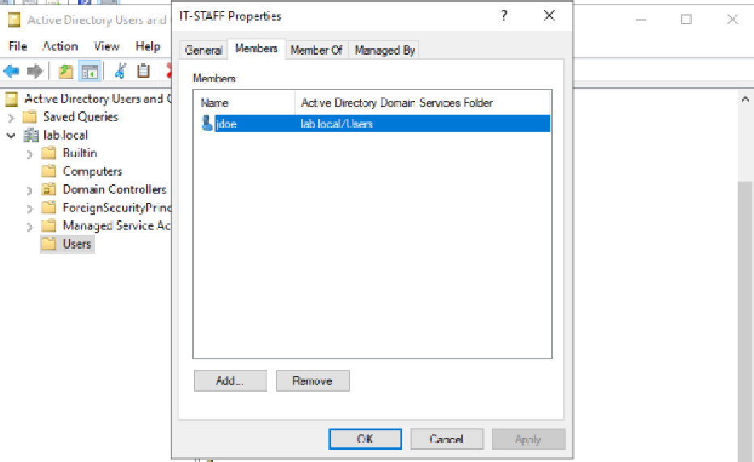
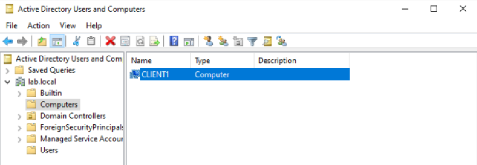
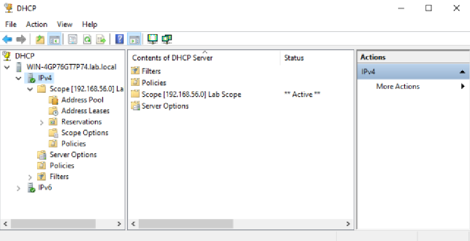
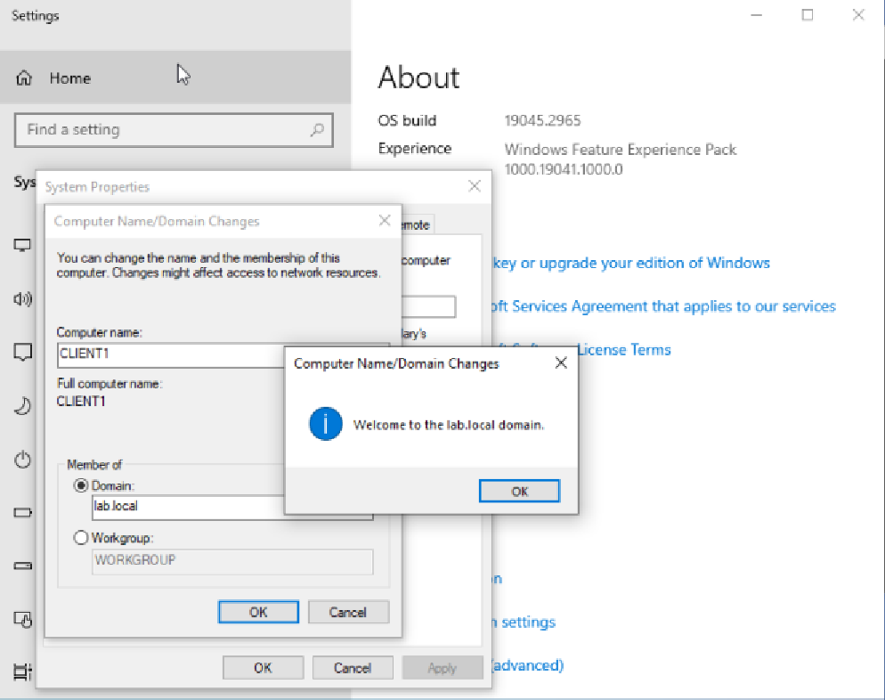
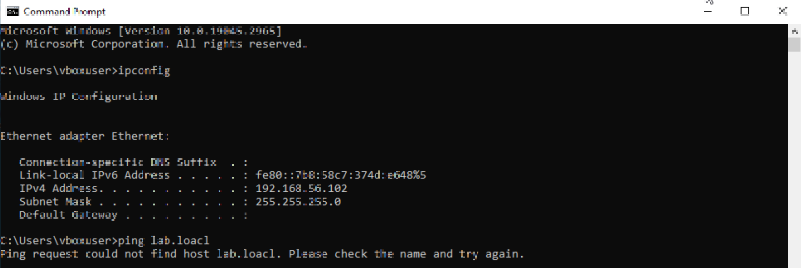
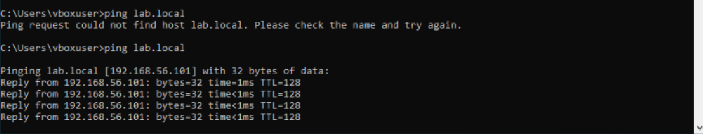

# 🖥️ Windows Server Active Directory Lab

> Simulating a corporate IT environment using Windows Server 2022, Active Directory, DNS, and DHCP — built from scratch in VirtualBox.

---

## 📋 Overview

This home lab replicates the core infrastructure found in real enterprise environments. A Windows Server 2022 domain controller manages authentication, IP addressing, and name resolution for a Windows 10 client machine — mirroring what a help desk or sysadmin would work with daily.

---

## 🧰 Environment

| Component | Details |
|---|---|
| Hypervisor | VirtualBox |
| Domain Controller | Windows Server 2022 (Desktop Experience) |
| Client Machine | Windows 10 |
| Domain Name | `lab.local` |
| Network Scope | `192.168.10.100 – 192.168.10.200` |

---

## 🏗️ Build Steps

### Step 1 — Virtualization Setup
- Installed VirtualBox and created two VMs: `WINSERV2022` (server) and `ClIENT1` (client) 
- WINSERV2022 specs: 4 GB RAM, 2 CPU cores, 50 GB disk

### Step 2 — Windows Server Installation & Role Configuration
- Installed Windows Server 2022 with Desktop Experience on WINSERV2022
- Added the following roles via Server Manager → *Add Roles and Features*:
  - Active Directory Domain Services (AD DS)
  - DNS Server
  - DHCP Server

### Step 3 — Promoted Server to Domain Controller
- Ran the AD DS post-install configuration wizard
- Created a new forest with the root domain: `lab.local`
- Server rebooted and came up as a fully functional domain controller

### Step 4 — Client VM Domain Join
- Installed Windows 10 on `CLIENT1`
- Navigated to *System → Change settings → Domain*
- Joined `lab.local` using domain admin credentials
- Verified login with domain account

### Step 5 — Active Directory: Users & Groups
- Opened **Active Directory Users and Computers**
- Created user: `jdoe`
- Created security group: `IT-Staff`
- Added `jdoe` to `IT-Staff`
- Logged into CLIENT1 as `lab\jdoe` to confirm access

### Step 6 — DHCP Scope Configuration
- Created a new scope in the DHCP Manager:
  - Range: `192.168.10.100 – 192.168.10.200`
  - Default Gateway: `192.168.10.1`
  - DNS Server: WINSERV2022's IP address
- Authorized the DHCP server in Active Directory

### Step 7 — DNS Record Creation & Testing
- Created a forward lookup A record: `fileserver.lab.local`
- Tested resolution from CLIENT1:
```
ping fileserver.lab.local
nslookup fileserver.lab.local
```

---

## 🔥 Intentional Break / Fix Scenario

**One of the most valuable parts of this lab — and a common interview topic.**

### What I broke:
- Changed CLIENT1's DNS server to an incorrect IP address

### Symptoms:
- Domain login failed
- Network resources unreachable by name
- `ping lab.local` returned "could not find host"

### Diagnosis steps:
```
ipconfig /all          → confirmed wrong DNS server listed
nslookup lab.local     → confirmed resolution failure
```

### Fix:
- Corrected the DNS server IP back to WINSERV2022's address 
- Ran `ipconfig /flushdns` and `ipconfig /renew`
- Retested with `ping fileserver.lab.local` — resolved successfully

---

## 📸 Screenshots

### AD Users and Computers
 


### DHCP Scope Configuration


### Client Domain Login


### Broken DNS — Error State


### Fixed DNS — Successful Resolution


---

## 💡 Skills Demonstrated

- Active Directory administration (users, groups, OUs)
- Promoting a server to a domain controller
- DHCP scope creation and authorization
- DNS A record configuration and testing
- Diagnosing and resolving DNS/connectivity failures
- Windows Server role deployment
- Domain join and authentication troubleshooting

---

## 📁 Repository Structure

```
windows-server-ad-lab/
├── README.md
└── screenshots/
    ├── ad-users-computers.png
    ├── dhcp-scope.png
    ├── client-domain-login.png
    ├── dns-broken-error.png
    └── dns-fixed-success.png
```

---

